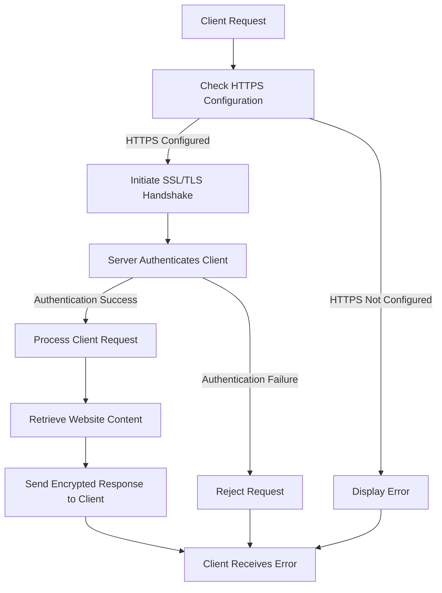

# Web Server with SSL/TLS Configuration on Red Hat Enterprise Linux (RHEL)

## Objective

The objective of this project is to set up a secure web server on Red Hat Enterprise Linux (RHEL) using 
Apache HTTP Server (HTTPD) and configure SSL/TLS to ensure encrypted communication between clients and the 
server.


## Project Overview

1.  **Planning and Preparation**
    
    -   Define requirements and objectives.
    -   Prepare the RHEL environment.
    -   Install Apache HTTP Server.
2.  **Apache HTTP Server Installation**
    
    -   Install and configure Apache HTTP Server.
    -   Set up a basic website.
3.  **SSL/TLS Configuration**
    
    -   Obtain and install SSL/TLS certificates.
    -   Configure Apache for SSL/TLS.
4.  **Testing and Validation**
    
    -   Test the HTTPS configuration.
    -   Verify SSL/TLS security.
5.  **Documentation and Conclusion**
    
    -   Document the setup process.
    -   Evaluate benefits, challenges, and performance.

## Step-by-Step Configuration

### 1. Planning and Preparation

-   **Install RHEL**: Ensure RHEL is installed and updated on the server node.
-   **Update System**:
       
    `sudo yum update -y` 
    

### 2. Apache HTTP Server Installation

#### On Web Server Node (e.g., `web-server`)

-   **Install Apache HTTP Server**:
    
    `sudo yum install httpd -y` 
    
-   **Start and Enable Apache Service**:

    
    `sudo systemctl start httpd
    sudo systemctl enable httpd` 
    
-   **Create a Basic Website**:
    -   Create a file at `/var/www/html/index.html` with:

        
        ```html
	<html>
        <head><title>Welcome to My Website</title></head>
        <body><h1>Hello, World!</h1></body>
        </html>``` 
        

### 3. SSL/TLS Configuration

#### Obtain and Install SSL/TLS Certificates

-   **Generate Self-Signed Certificate** (for testing purposes):
    

    
    `sudo mkdir /etc/httpd/ssl
    sudo openssl req -newkey rsa:2048 -nodes -keyout /etc/httpd/ssl/server.key -x509 -days 365 -out 
/etc/httpd/ssl/server.crt` 
    
-   **Configure Apache for SSL/TLS**:
    -   Edit `/etc/httpd/conf.d/ssl.conf` and update:

        
        `SSLEngine on
        SSLCertificateFile /etc/httpd/ssl/server.crt
        SSLCertificateKeyFile /etc/httpd/ssl/server.key` 
        
-   **Restart Apache Service**:
    

    
    `sudo systemctl restart httpd` 
    

### 4. Testing and Validation

-   **Test HTTPS Configuration**:
    -   Open a web browser and navigate to `https://<server_ip>`. Verify that the website loads and the 
connection is encrypted.
-   **Verify SSL/TLS Security**:
    -   Use tools like `openssl` or online SSL/TLS checkers to verify the strength and validity of the 
SSL/TLS configuration:

        `openssl s_client -connect <server_ip>:443` 
        

### 5. Documentation and Conclusion

-   **Document Configuration**: Record all installation and configuration steps, including SSL/TLS 
certificates and Apache settings.
-   **Evaluate Benefits**:
    -   **Secure Communication**: Ensures encrypted communication between clients and server.
    -   **Data Integrity**: Protects data from tampering during transmission.
-   **Challenges**:
    -   **Certificate Management**: Requires renewal and proper handling of SSL/TLS certificates.
    -   **Configuration Complexity**: Ensure correct configuration of Apache and SSL/TLS settings.
